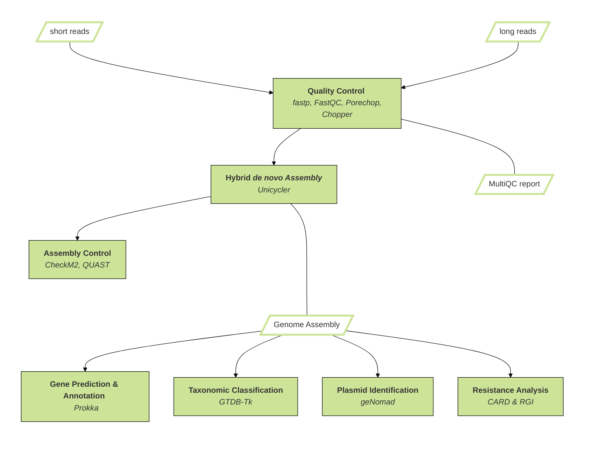

# HyDRA – Hybrid De novo Assembly and Resistance Analysis

[](https://snakemake.github.io)
[](https://github.com/<owner>/<repo>/actions?query=branch%3Amain+workflow%3ATests)


HyDRA is a state-of-the-art and user-friendly Snakemake workflow designed for the analysis of WGS data. It integrates multiple bioinformatics tools and algorithms to facilitate key steps in WGS analysis, including quality control of sequencing reads, hybrid assembly, taxonomic classification, gene prediction and annotation as well as identification of plasmids and antibiotic resistance genes (ARGs).<br />

### Key Features

**Comprehensive Quality Control**: Involves a thorough assessment and filtering of sequencing data to identify and remove errors, ensuring high-quality and reliable data for downstream analysis.<br />

**Hybrid Assembly**: Utilize short and long sequencing reads in combination to create more accurate and complete genome assemblies, leveraging the strengths of both read types.<br />

**Taxonomic Classification**: Apply advanced taxonomic classification methods to assign taxonomic labels to the isolate.<br />

**Gene Prediction and Annotation**: Utilizing methods to identify gene locations within a genome assembly and annotating their functions, enabling to understand the biological roles and interactions of the genes.<br />

**Plasmid Identification**: Involves methods to detect and characterize plasmid DNA within a genomic dataset, differentiating it from chromosomal DNA to study its role in horizontal gene transfer and other functions.<br />

**Antibiotic Resistance Gene Identification**: Perform in-depth analysis to detect and characterize antibiotic resistance genes within the sample, providing valuable insights into antimicrobial resistance profiles.<br />

### Overview


## Usage
### Preparations
To prepare the workflow
1. Clone it to your desired working directory via git or your preferred IDE
2. Edit the `config/config.yaml` file:
   - Specify the run date or project name (`run_name`)
3. Provide a sample information in the `config/pep/samples.csv` file with keeping the header and format as `.csv`:

```
sample_name,long,short1,short2
sample1, path/to/your/long_read/fastq/sample1.fastq.gz,path/to/your/short_read /fastq/sample1_R1.fastq.gz,path/to/your/short_read /fastq/sample1_R2.fastq.gz
```
### Run the workflow
```snakemake --use-conda --cores all ```

The usage of this workflow is described in the [Snakemake Workflow Catalog](https://snakemake.github.io/snakemake-workflow-catalog/?usage=<owner>%2F<repo>).

## License

HyDRA is released under the [BSD-2 Clause](https://www.open-xchange.com/hubfs/2_Clause_BSD_License.pdf?hsLang=en). Please review the license file for more details.

## Contact Information

For any questions, or feedback, please contact the project maintainer at josefa.welling@uk-essen.de. We appreciate your input and support in using and improving HyDRA.

### Tools
[CARD & RGI] (https://doi.org/10.1093/nar/gkac920)<br />
[Checkm2] (https://doi.org/10.1038/s41592-023-01940-w)<br />
[Chopper] (https://doi.org/10.1093/bioinformatics/btad311)<br />
[fastp](https://doi.org/10.1093/bioinformatics/bty560)<br />
[FastQC](https://github.com/s-andrews/FastQC)<br />
[geNomad] (https://doi.org/10.1038/s41587-023-01953-y)<br />
[minimap2](https://doi.org/10.1093/bioinformatics/bty191)<br />
[MultiQC](https://doi.org/10.1093%2Fbioinformatics%2Fbtw354)<br />
[Nanoplot] (https://doi.org/10.1093/bioinformatics/btad311)<br />
[pandas](https://doi.org/10.5281/zenodo.3509134)<br />
[PLM-ARG] (https://doi.org/10.1093/bioinformatics/btad690)<br />
[Porechop_ABI] (https://doi.org/10.1093/bioadv/vbac085)<br />
[Prokka] (https://doi.org/10.1093/bioinformatics/btu153)<br />
[QUAST] (https://doi.org/10.1093/bioinformatics/btt086)<br />
[samtools](https://doi.org/10.1093/gigascience/giab008)<br />
[Unicycler] (https://doi.org/10.1371/journal.pcbi.1005595)<br />

### Literature
[Not here yet](https://www.lipsum.com/feed/html)

## Citation

A paper is on its way. If you use HyDRA in your work before the paper, then please consider citing this GitHub.
